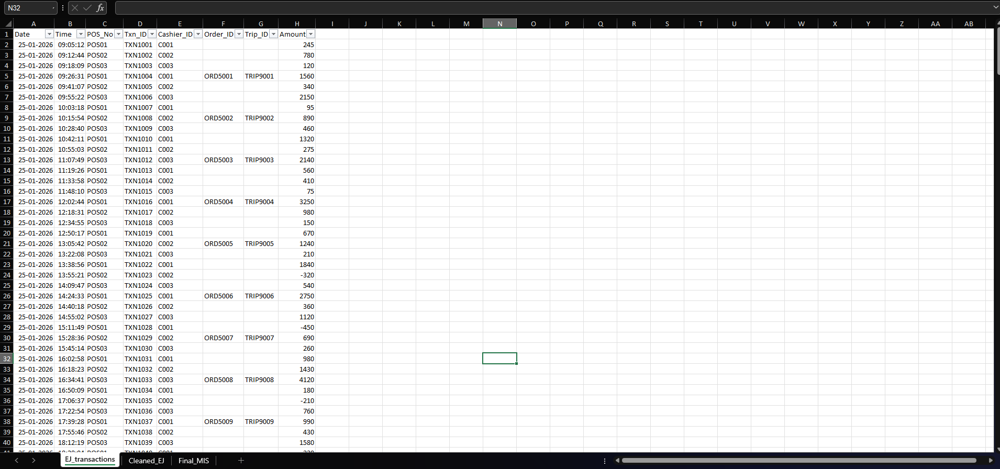
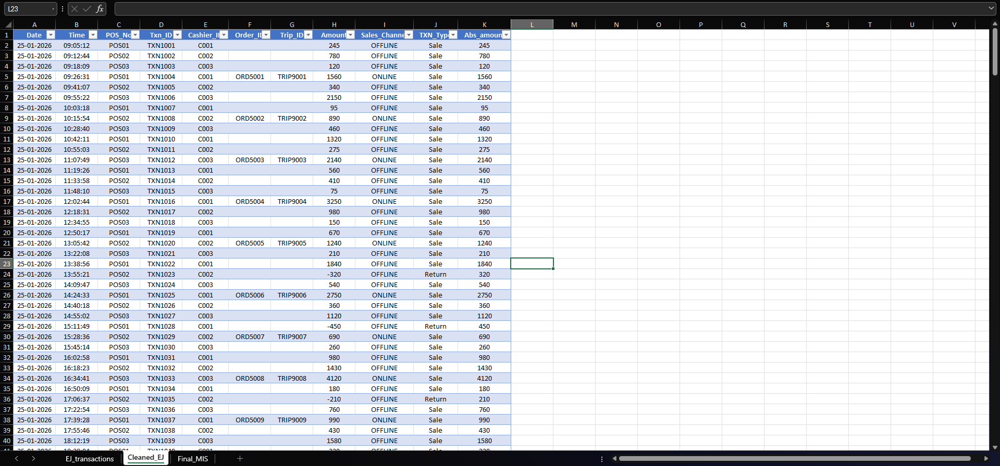
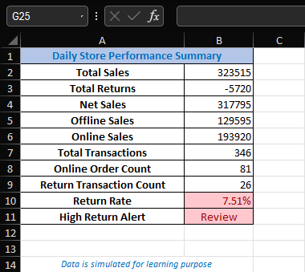

# Retail Sales Reconciliation MIS

A formula-driven Excel MIS that reconciles daily retail sales and returns from simulated electronic journal (EJ) transaction data, and summarises store performance for management review.

## Walkthrough

**1. Raw EJ transaction data**

**2. Processed data: transactions classified into sales/returns and online/offline**

**3. Dashboard: generated insights (sales, returns, return rate, alert)**

## What it does

- Cleans and classifies 346 transactions into sales and returns
- Separates online and offline transactions
- Calculates net sales, transaction volume, online order count, return count, and return rate
- Flags high return activity for operational review using an automated alert

## Results

| Metric | Value |
|---|---|
| Total sales | INR 323,515 |
| Total returns | INR -5,720 |
| Net sales | INR 317,795 |
| Offline sales | INR 129,595 |
| Online sales | INR 193,920 |
| Transactions | 346 |
| Online orders | 81 |
| Return transactions | 26 |
| Return rate | 7.51% |
| High return alert | Review |

## Key findings

- Online orders were about 23% of transactions (81 of 346) but about 60% of gross sales value.
- Return rate was 7.51% (26 of 346 transactions), which triggered the high-return alert. [Add the threshold that triggers the alert, e.g. "alert fires above X%".]

## How it works

[2 or 3 lines: how raw EJ rows are classified into sale/return and online/offline, and which Excel functions drive it, e.g. IF, SUMIFS, COUNTIFS.]

## Files

- `Daily_Sales_Reconciliation_MIS.xlsx`: daily store performance summary

## Notes

Data is simulated for learning and demonstration, based on the structure of retail EJ records.